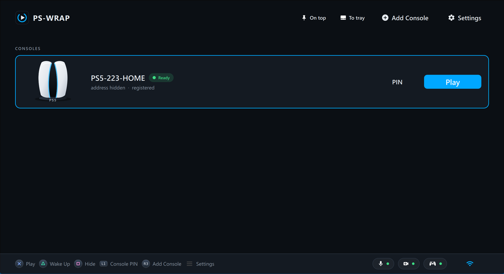
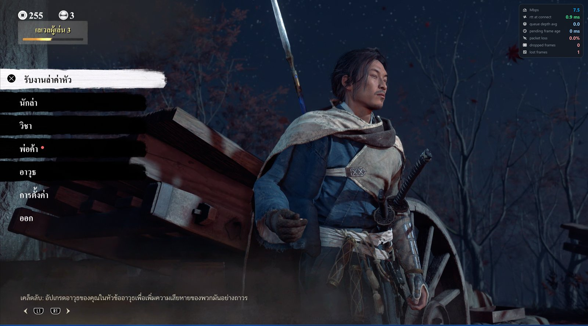
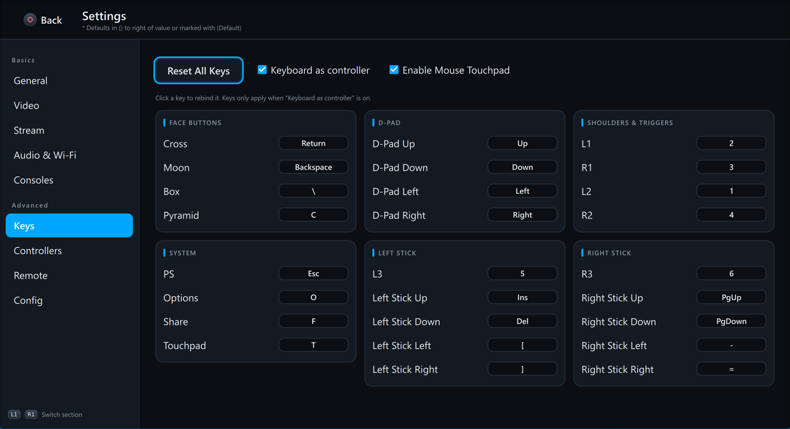
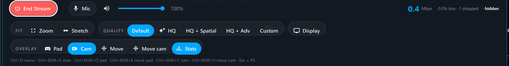
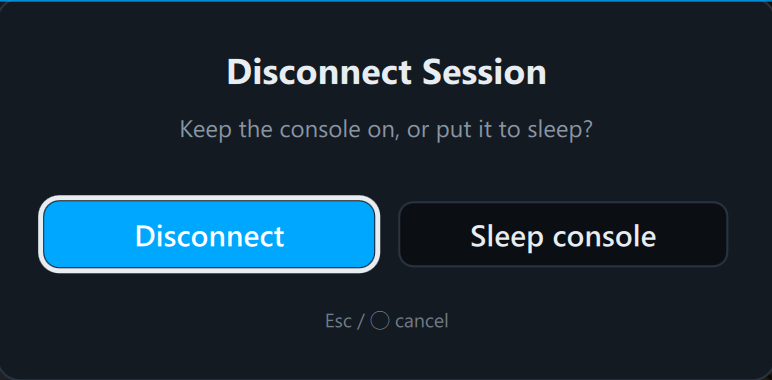
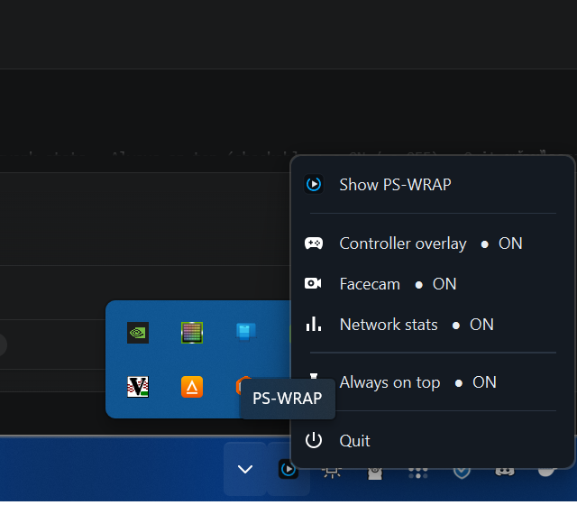

# PS-WRAP

PS4 / PS5 Remote Play client สำหรับ Windows ที่ออกแบบ UI ใหม่ทั้งหมด ให้ทันสมัยและเล่นด้วยจอยอย่างเดียวได้
พัฒนาต่อจาก [chiaki-ng](https://github.com/streetpea/chiaki-ng) โดยทีม BudToZai — แกน streaming (`ps-wrap/lib/`) คงเดิมจาก upstream



| ระหว่างสตรีม: การ์ด network stats | Settings › Keys |
|---|---|
|  |  |

**เมนูระหว่างสตรีม** — กด Ctrl+O หรือ L1+R1+L3+R3



| Disconnect (ค่าเริ่มต้นไม่สั่งเครื่องหลับ) | เมนู system tray |
|---|---|
|  |  |

## มีอะไรใหม่จาก chiaki-ng

- **UI ใหม่ทั้งชุด** — design system (`controls/Theme.qml`), หน้าหลักแบบ console card, Settings แบบ sidebar 9 หน้า, หน้า Keys ใหม่, responsive ทุกขนาดหน้าต่าง, ใช้จอยนำทางได้ทุกหน้า
- **เมนูระหว่างสตรีมใหม่** + toast, Disconnect dialog ที่ค่าเริ่มต้นเป็น Disconnect (ไม่สั่งเครื่องหลับโดยไม่ตั้งใจ)
- **Overlay ระหว่างสตรีม 3 ตัว**: controller overlay, การ์ด network stats, facecam — ย่อ/ขยาย/ย้ายได้ (คลิกที่ overlay เพื่อแก้) และยึดกรอบวิดีโอ
- **Facecam**: เลือกกล้อง (รวมกล้องเสมือน DirectShow), zoom/pan/mirror/วงกลม, ตัดพื้นหลังด้วย chroma key หรือ AI (ไม่ต้องใช้ฉากเขียว), face effects ที่เกาะหน้าด้วย MediaPipe Face Landmarker
- **System tray** + เมนูเปิด/ปิด overlay, hide to tray, single instance, จำตำแหน่ง/ขนาดหน้าต่าง
- **แก้ความเสถียร**: crash/ค้างจาก Qt Quick sync ข้าม thread และ assert ของ libplacebo ตอน resize, ปุ่มไม่ติดหลังปิดเมนู ฯลฯ — รายละเอียดใน [CHANGELOG.md](CHANGELOG.md)
- ที่เก็บข้อมูลแยกจาก chiaki-ng (`HKCU\Software\PS-WRAP`, `%APPDATA%\PS-WRAP`) — เปิดครั้งแรกย้าย settings และเครื่องที่ลงทะเบียนจาก chiaki-ng ให้อัตโนมัติ

## โครงสร้าง

| ที่ | มีอะไร |
|---|---|
| `ps-wrap/` | source ทั้งหมด (ฐานจาก chiaki-ng) — UI อยู่ที่ `ps-wrap/gui/src/qml/`, โค้ด C++ ของเราขึ้นต้นด้วย `pswrap*` |
| `scripts/` | PowerShell: ติดตั้ง MSYS2 + deps, build, run, deploy, เครื่องมือทดสอบ |

## Build (Windows, MSYS2 mingw64)

```powershell
git clone --recurse-submodules https://github.com/iDevGIS/PS-WRAP.git
cd PS-WRAP
.\scripts\setup-msys2.ps1        # ติดตั้ง MSYS2 + deps (ครั้งเดียว)
.\scripts\setup-extra-deps.ps1   # libplacebo / SDL ที่ต้อง build เอง (ครั้งเดียว)
.\scripts\build.ps1              # → ps-wrap\build\gui\chiaki.exe
.\scripts\run.ps1                # รันตัวที่ build
.\scripts\deploy.ps1 -StartMenu  # รวมเป็นโฟลเดอร์พกพา dist\PS-WRAP + shortcut ใน Start Menu
```

ใช้ PowerShell 7 (`pwsh`) — สคริปต์มีภาษาไทย Windows PowerShell 5 อ่านเพี้ยน
Facecam แบบ AI ต้องมี `onnxruntime.dll` (ONNX Runtime 1.30 win-x64) วางข้าง `chiaki.exe`

## Credits

- **[chiaki-ng](https://github.com/streetpea/chiaki-ng)** โดย Street Pea และผู้ร่วมพัฒนา — PS-WRAP แยกมาจาก commit `a9a2805` (v1.9.9)
- **[Chiaki](https://git.sr.ht/~thestr4ng3r/chiaki)** โดย Florian Märkl และผู้ร่วมพัฒนา — ต้นฉบับของ chiaki-ng
- Submodules ของ upstream: curl, nanopb, jerasure, gf-complete, munit, cpp-steam-tools, oboe, borealis
- [ONNX Runtime](https://github.com/microsoft/onnxruntime) (MIT) — headers ใน `ps-wrap/third-party/onnxruntime`
- โมเดล AI (Apache-2.0, Google MediaPipe): Selfie Segmentation (ONNX โดย onnx-community), BlazeFace (ONNX โดย garavv/blazeface-onnx), Face Landmarker 478 จุด (ONNX โดย senty-au)
- [Input Prompts](https://kenney.nl/assets/input-prompts) โดย Kenney (CC0) — ภาพจอย PS4/PS5
- ภาพเกราะซามูไร `samurai_photo.png`: Wikimedia Commons *MAP Expo Sujibachi kabuto Menpo 06 01 2012.jpg* (CC0) — ตัดพื้นหลังและเจาะช่องตา

ภาพ effect ที่ตัดจากเกม (`fx/jin_*.png`) ใช้ส่วนตัวเท่านั้น ไม่อยู่ใน repo และห้ามแจก

## License

**AGPL-3.0** (with OpenSSL exception) ตาม chiaki-ng — ดู [LICENSE](LICENSE) และ `ps-wrap/LICENSES/`
ถ้าแจก binary ของ PS-WRAP ให้ใคร ต้องให้ source code ของเวอร์ชันนั้นด้วย
PlayStation, PS4 และ PS5 เป็นเครื่องหมายการค้าของ Sony Interactive Entertainment — โปรเจกต์นี้ไม่เกี่ยวข้องกับ Sony
