# PS-WRAP

English · [ภาษาไทย](README.th.md)

PS-WRAP is a PS4 / PS5 Remote Play client for Windows with a redesigned, modern interface that you can use with a controller alone.
It is built on [chiaki-ng](https://github.com/streetpea/chiaki-ng) by the BudToZai team. The streaming core (`ps-wrap/lib/`) comes from upstream.

▶️ **Demo stream:** [youtube.com/live/8sWkgmj81Aw](https://www.youtube.com/live/8sWkgmj81Aw).

💬 **Discord:** [discord.gg/6VTSxu8JRf](https://discord.gg/6VTSxu8JRf) for help, news and beta builds.

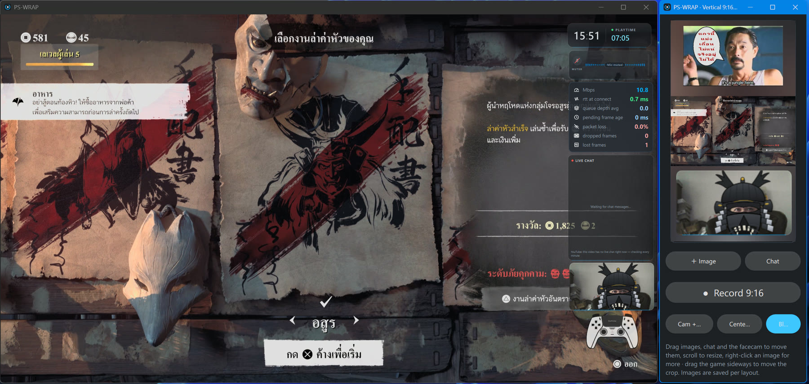

*Playing with the 9:16 window open: overlays on the game screen, and next to it the vertical picture for Shorts / TikTok / Reels with an image on top and the facecam below (Blur fill layout).*

## Screenshots

### Home screen


- One card per console: PS5 / PS4 art by model, a status chip (Ready / Standby / Remote) and a big **Play** button.
- The bottom bar has controller hints on the left and status chips on the right: microphone, speaker (with volume), camera, controller, **Recordings**, **Screenshots**, Discovery and **ⓘ About**. Click a chip to open its page or menu; click outside a menu to close it.
- Everything works with a controller: ✕ Play, △ wake up, □ hide, L1 PIN, R3 add console, ☰ Settings. The hints are buttons too, so you can click them with the mouse.

| ⓘ About and credits | Controller status | Microphone test |
|---|---|---|
| 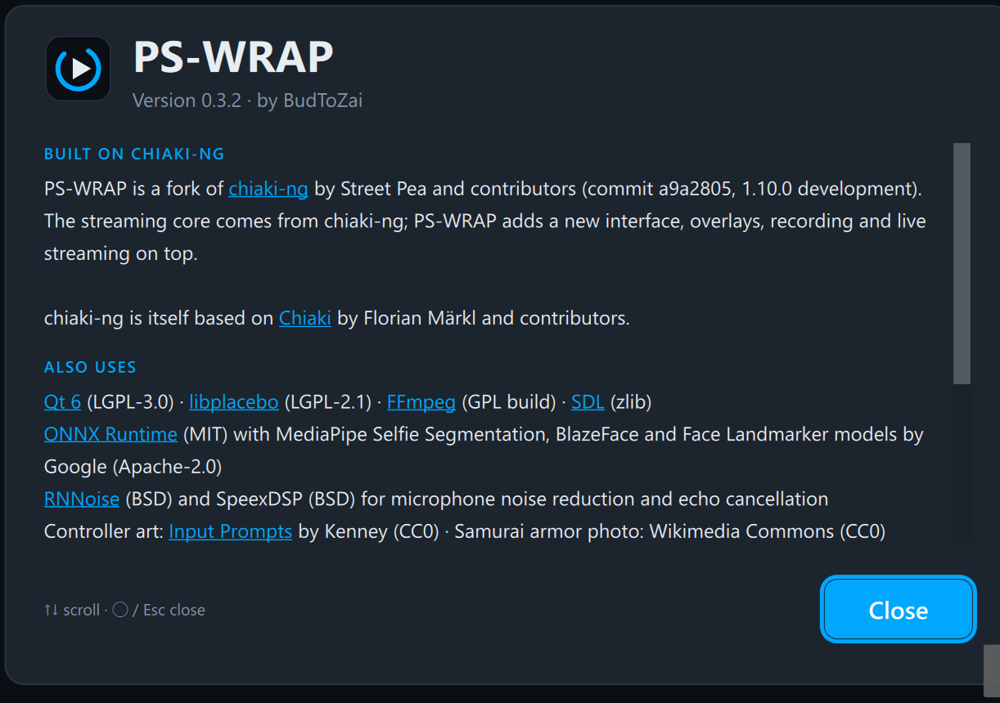 | 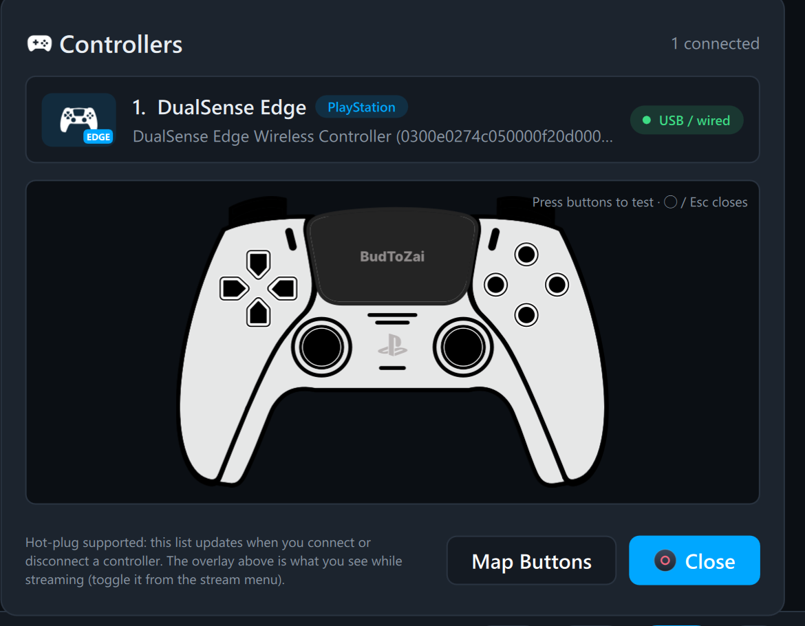 | 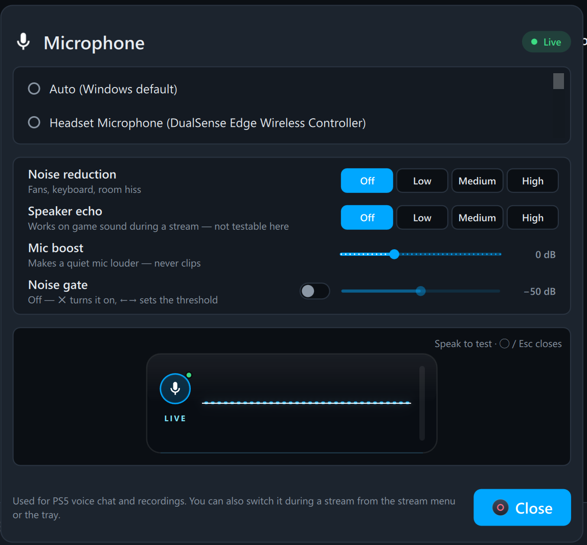 |
| Version, credits for chiaki-ng and Chiaki, every bundled library with its license, and a **Licenses** button. | Connected controllers, connection type and battery, plus a live preview that lights up as you press buttons. | Pick the microphone and set noise reduction, speaker echo removal, mic boost and noise gate while you hear the result. |

### While streaming


The game with every overlay turned on. Each one can be dragged and resized (click it to edit, or use **Move** in the stream menu with a controller):

- **Live chat** (left): YouTube and Twitch messages, with colored names and badges.
- **Clock and play time** (top right).
- **Mic visualizer**: shows that you are muted or speaking; click it to mute.
- **Network stats**: bitrate, ping at connect, packet loss and dropped/lost frames.
- **Controller overlay** (bottom right): buttons light up and sticks move as you play.

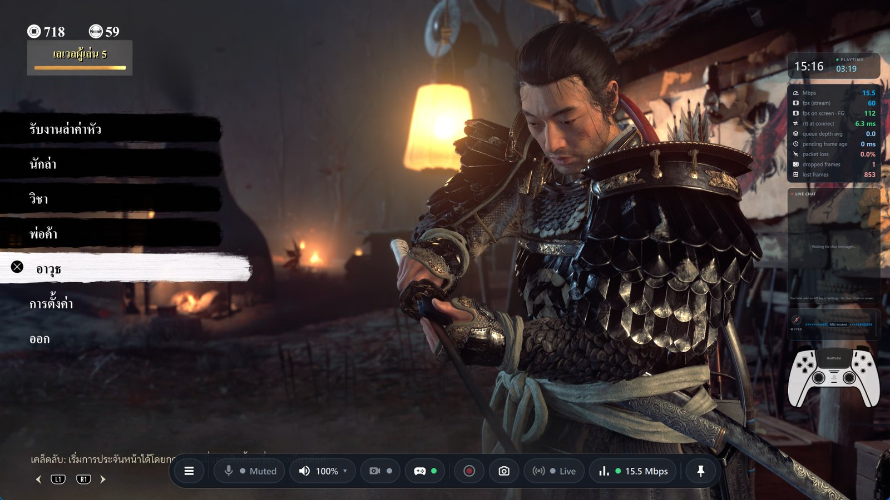

**Status bar**: move the mouse to the bottom of the window and a bar appears. From left to right: ☰ the stream menu, mute the mic, speaker and volume, facecam, controller overlay, record, screenshot, **Go Live**, and network (Mbps; click for stream stats). Click 📌 to keep the bar on screen. Clicks outside the bar still go to the game.

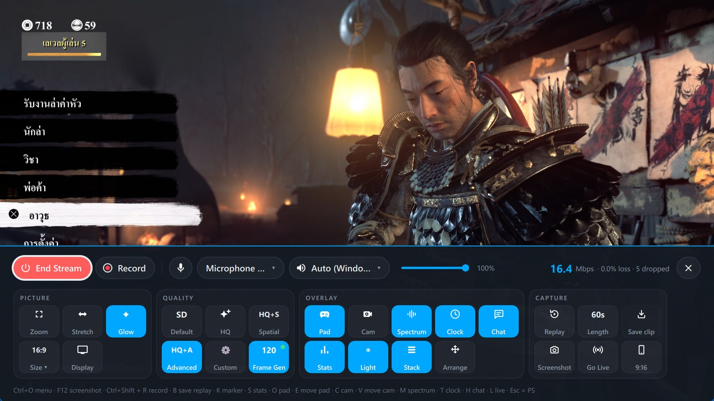

The stream menu (Ctrl+O, L1+R1+L3+R3, ☰ on the status bar, or the tray):

- **Top row**: **End Stream**, **Record**, mic on/off, microphone and speaker devices, volume, live stream stats, and **✕** to close the menu.
- **PICTURE**: Zoom, Stretch, Glow, **Size ▾** (exact 16:9 window sizes) and Display settings.
- **QUALITY**: Default, HQ, HQ + Spatial, HQ + Advanced, Custom and **Frame Gen** (60 → 120 fps).
- **OVERLAY**: Pad, Cam, Spectrum, Clock, Chat, Stats, Light, Stack and **Move** (pick which overlay to move or resize).
- **CAPTURE**: Instant Replay (on/off, length, Save), Screenshot, **Go Live** and **9:16**.

The cards wrap onto a new line on narrow windows instead of being cut off. With a controller, the D-pad moves to the nearest button on screen, ✕ presses and ◯ closes.

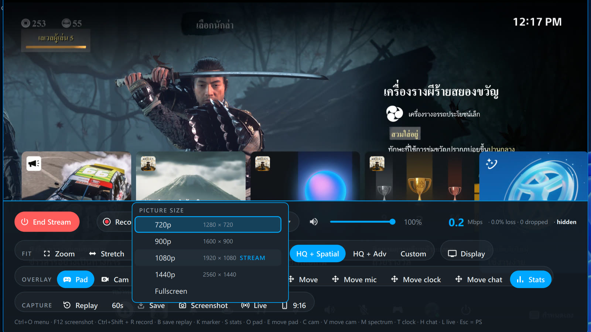

**Size ▾** sets the window so the video area is exactly 720p, 900p, 1080p or 1440p (16:9, no black bars, real pixels even at 150 % display scaling). The **STREAM** tag marks the size that matches the stream resolution, and sizes larger than your screen are hidden.

### Vertical 9:16 and Go Live

| Vertical 9:16 window | Settings › Go Live and chat on screen |
|---|---|
| 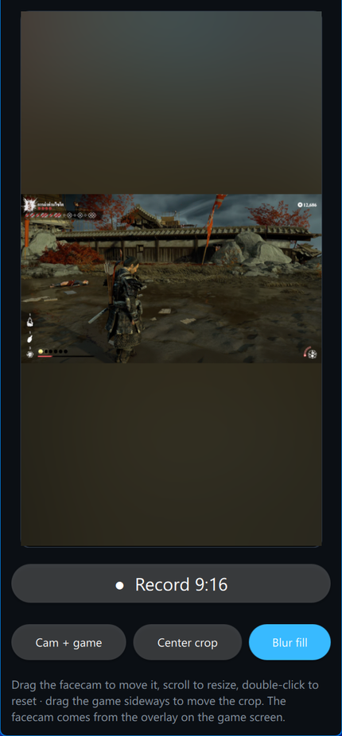 | 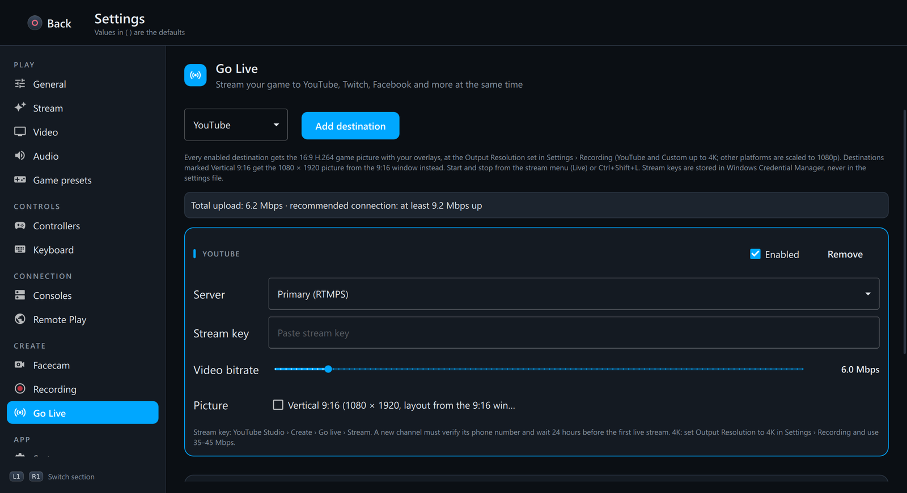 |
| A live vertical picture for Shorts / TikTok / Reels, here in Blur fill with a banner image, an animated "LIVE" GIF and the chat card. Choose Cam + game, Center crop or Blur fill; drag the facecam, the crop, your images and the chat card; add PNG/JPG/GIF images from a file or a link (Giphy); and record 1080 × 1920 clips. | Add YouTube, Twitch, Facebook, Kick or custom RTMP(S) destinations with their own bitrate, mark any of them Vertical 9:16, and set up the on-screen chat (YouTube source, API key, Twitch channel). Keys stay in Windows Credential Manager. |

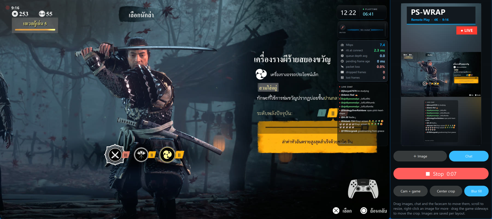

Recording a 9:16 clip while playing: the button turns into **■ Stop** with the elapsed time, and a blinking REC dot labelled **9:16** appears at the top left of the game screen (on screen only, not in the file).

### Connection check, updates and PSN sign-in

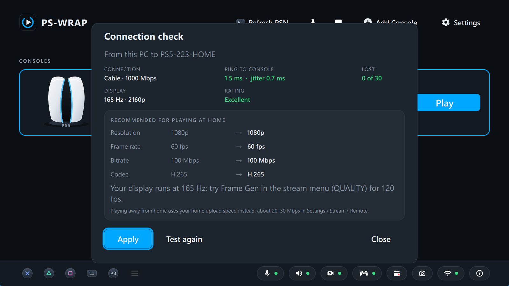

**Connection check** (**Test** on a console card, or Settings › Stream › **Check my connection**): measures the cable or Wi-Fi link to the console (speed, Wi-Fi standard, band and signal) and the ping, jitter and loss to it, then recommends resolution, frame rate, bitrate and codec next to your current values. **Apply** sets them.

| Update inside the app | PSN sign-in |
|---|---|
| 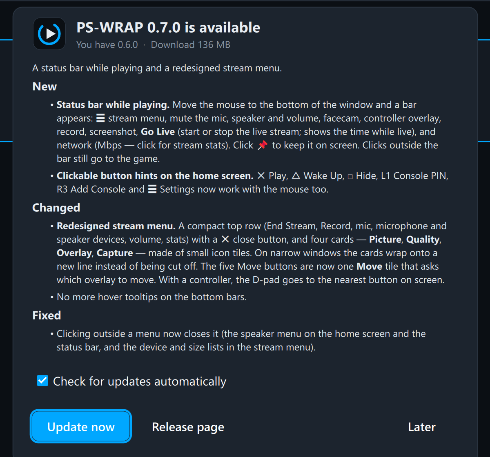 | 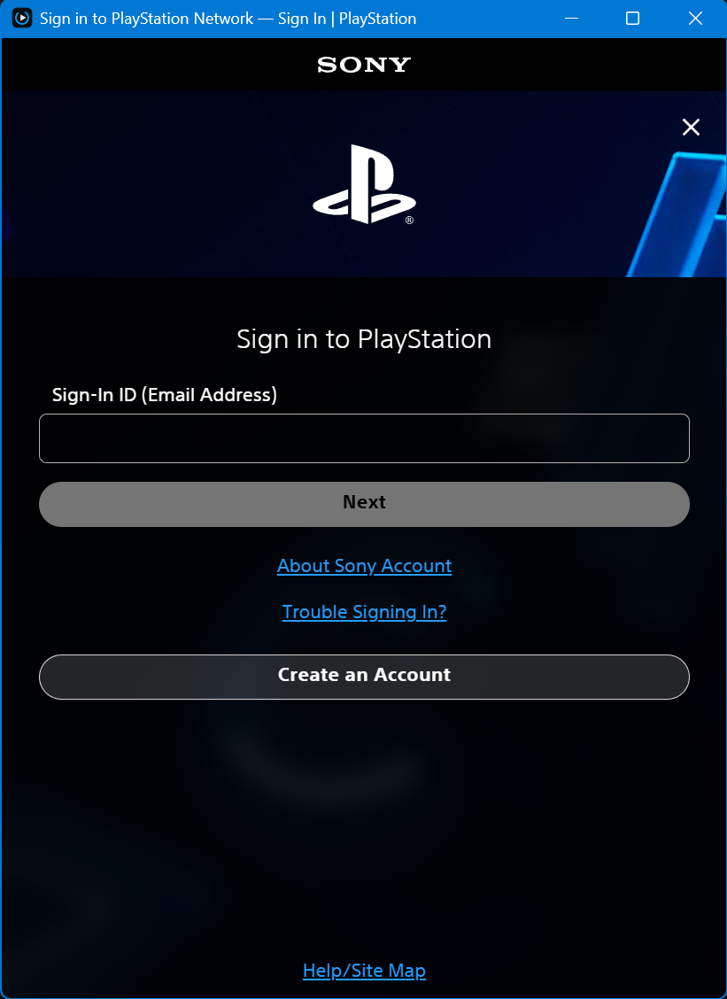 |
| When a new version is out, an **Update x.y.z** chip appears on the home screen bar. **Update now** downloads it and checks its SHA-256; **Restart and update** puts it in place and opens PS-WRAP again, with your settings kept. | **Login to PSN** opens Sony's sign-in page in a window inside PS-WRAP. When you finish, it closes by itself and PS-WRAP completes the setup: no link to copy, no address to paste back. |

### Settings

| Video | Stream |
|---|---|
| 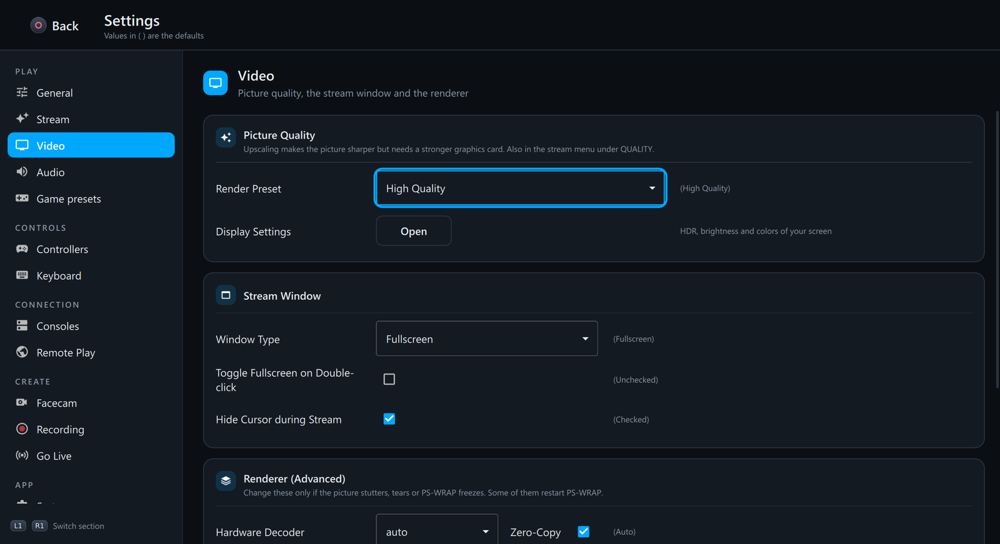 | 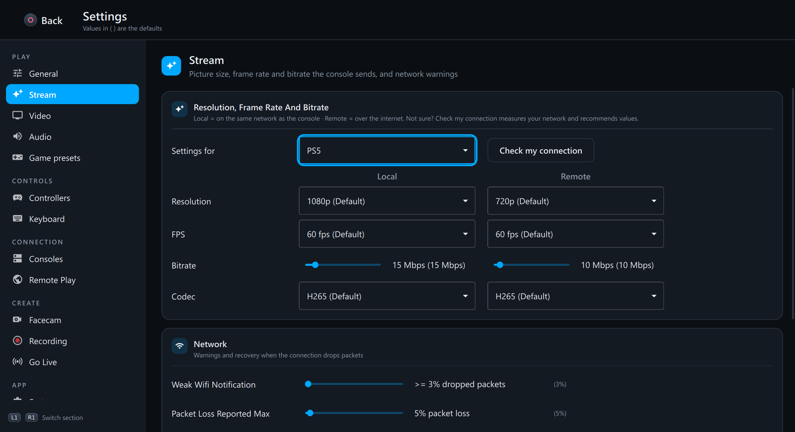 |
| Cards for picture quality (render preset up to HQ + Advanced Spatial upscaling, display settings), the stream window, and the renderer (decoder, V-Sync, frame delivery, Vulkan / OpenGL). | Resolution, frame rate, bitrate and codec, separately for PS5 / PS4 and for home (local) and remote play, plus **Check my connection** and network warnings. |


Settings › Keyboard: every PlayStation button mapped to a keyboard key, grouped into cards (face buttons, D-pad, shoulders and triggers, system, sticks), all reachable with a controller. The sidebar groups the pages, each with an icon, into Play (General, Stream, Video, Audio, Game presets), Controls (Controllers, Keyboard), Connection (Consoles, Remote Play), Create (Facecam, Recording, Go Live) and App (System); every page is split into titled cards. On a small window the sidebar shrinks to icons and each setting stacks with its name on top, so nothing runs off the edge; the mouse wheel scrolls every list.

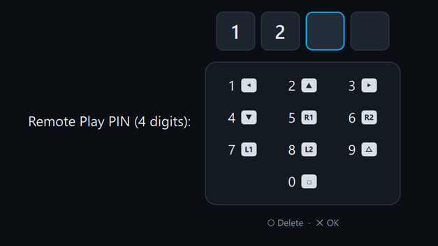

Console PIN with a controller, like the passcode screen on the PS5: each button types one digit (◀1 ▲2 ▶3 ▼4 R1 5 R2 6 L1 7 L2 8 △9 □0), the fourth digit confirms by itself and Circle deletes. Used when connecting to a console with a login PIN (also over PSN) and in *Set console pin* on the home screen.

### System tray and disconnect

| System tray menu | Disconnect |
|---|---|
|  |  |
| Open the stream menu or Settings, set the picture size, open the 9:16 window, record, toggle overlays, choose the facecam effect and background, switch the microphone, record presets, Instant Replay, screenshots, Go Live and always on top, all without touching the game window. | Ending a stream asks whether to keep the console on. **Disconnect** is the default, so a stray button press can't put your PS5 to sleep. |

## Download

Get the latest zip from [Releases](https://github.com/iDevGIS/PS-WRAP/releases), unzip it anywhere and run `PS-WRAP.exe`. You don't need to install anything.
If you used chiaki-ng on the same PC, PS-WRAP copies its settings and registered consoles on first launch (chiaki-ng's data is left untouched).

## Best tested settings

These settings gave the sharpest and smoothest picture in our tests: PS5 on ordinary home Wi-Fi 5 (802.11ac, about 1.5 ms ping), NVIDIA RTX 4090, 165 Hz display, playing Ghost of Yōtei. The picture looked sharper than playing on the TV connected to the console.

| Setting | Where | Value | Why |
|---|---|---|---|
| Resolution | Settings › Stream › Local | **1080p** | The highest Remote Play allows |
| FPS | Settings › Stream › Local | **60 fps** | 30 fps is clearly less smooth |
| Bitrate | Settings › Stream › Local | **100 Mbps** (max) | Worked on Wi-Fi 5 in our test; lower it if Stats shows packet loss |
| Codec | Settings › Stream › Local | **H.265** | Better picture than H.264 at the same bitrate |
| Hardware Decoder | Settings › Video | **cuda** on NVIDIA (auto picks a GPU decoder on others) | Decodes on the graphics card |
| Render Preset | Settings › Video (or stream menu › QUALITY) | **HQ + Advanced Spatial Upscaling** | Upscales 1080p with an AI upscaler (FSRCNNX) instead of a plain stretch; this is what makes it look sharper than the console |
| Frame Delivery | Settings › Video | **Direct Mapping** (default) | Lowest delay; Frame Gen needs it |

**Playing over the internet** (Settings › Stream › Remote): keep 1080p / 60 fps but set the bitrate to about **20–30 Mbps**. Remote Play uses your home upload speed, and 100 Mbps will stutter or drop on most connections.

**Optional, in the stream menu (Ctrl+O):**
- **Frame Gen** (QUALITY): 60 → 120 fps on a display faster than 60 Hz. Smoothest with G-SYNC / FreeSync (VRR) or a 120 Hz display; on a fixed 144/165 Hz display without VRR, frame timing can feel uneven, so compare it on and off. Adds about 8 ms of delay.
- **Glow** (FIT): fills black bars with a soft glow from the game. Useful on ultrawide screens.
- **Light** (OVERLAY): a glow around the picture in the controller light color, when the game sets one.

## Reporting problems

PS-WRAP is an independent fork, **not an official chiaki-ng release**. Please report PS-WRAP bugs and ideas in this repository's [Issues](https://github.com/iDevGIS/PS-WRAP/issues) or in the **#help** forum on our [Discord](https://discord.gg/6VTSxu8JRf), not to chiaki-ng.

**Easiest way: run `PS-WRAP-Diagnostics.exe`** (in the PS-WRAP folder, next to `PS-WRAP.exe`). It works even when PS-WRAP itself won't open:

1. It checks your PC by itself: PS-WRAP files, Windows, graphics driver, whether Vulkan works or freezes, overlay apps that hook into games, recent crashes and freezes (Windows Error Reporting and Event Log), and PS-WRAP's logs.
2. **Test launch** opens PS-WRAP and records everything it prints, with a detailed (verbose) log if you like. If PS-WRAP stops responding, the tool saves the exact place where it is stuck. **Test with OpenGL (safe mode)** does the same without Vulkan.
3. **Save report (.zip)** puts one zip on your Desktop to attach to an issue. **Copy summary** gives a short text that fits in one Discord message. **Report on GitHub** opens a new issue with the summary already filled in.

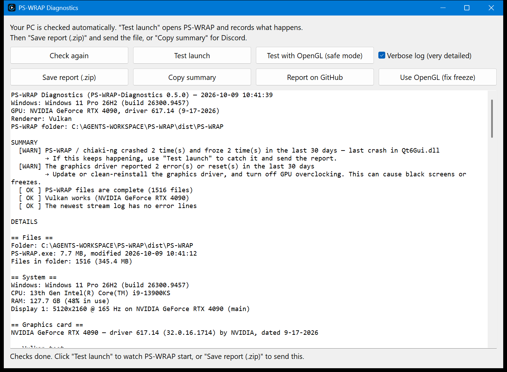

If PS-WRAP freezes with "Not responding" as soon as it opens, click **Use OpenGL (fix freeze)**. PS-WRAP will then start with OpenGL instead of Vulkan. You can switch back with the same button.

The report never contains your PSN sign-in, stream keys, console registration or channel names. Your Windows user name, PC name, home folder and internet IP address are replaced with placeholders.

## What's new compared to chiaki-ng

- **A new interface throughout**:
  - Console-card home screen, and Settings with an icon sidebar grouped by task (Play, Controls, Connection, Create, App) and titled cards on every page.
  - Enter the console PIN with a controller (PS5-style keypad).
  - A redesigned stream menu and a new Keys page.
  - Responsive at any window size.
  - Every screen works with a controller (Steam Deck / TV friendly).
- **Overlays while streaming**: controller, network stats, facecam, mic visualizer, clock and **live chat (YouTube + Twitch)**. Place each one freely, or turn on **Stack** to line them all up in one column at the same width and move, resize and reorder the whole column at once.
- **Picture**:
  - **Frame Gen**: an in-between frame for every stream frame, 60 → 120 fps on fast displays (motion estimated on the GPU).
  - **Glow**: black bars around the picture become a soft glow from the game (great on ultrawide screens).
  - **Light**: the controller light color set by the game glows around the picture and on the controller overlay.
  - AI upscaling (FSRCNNX) from the QUALITY presets — see [Best tested settings](#best-tested-settings).
- **Facecam**:
  - Any camera, including DirectShow virtual cameras.
  - Zoom, pan, mirror and circle.
  - Background removal with chroma key or AI (no green screen needed).
  - 3D face effects that follow your head (MediaPipe Face Landmarker).
- **Capture**:
  - Clip recording with every overlay (H.264 / HDR HEVC, three audio tracks).
  - Instant Replay and chapter markers.
  - One-button screenshots, with HDR PNG for HDR streams.
  - Output at stream resolution, 1440p or **4K (upscaled)**.
- **Go Live**:
  - Stream to YouTube, Twitch, Facebook, Kick and custom RTMP(S) at the same time.
  - Up to 4K on YouTube/Custom.
  - **Vertical 9:16** destinations for TikTok / Shorts / Reels.
  - Stream keys are kept in Windows Credential Manager.
- **Vertical 9:16 window**:
  - Live preview with three layouts.
  - Drag the facecam and the crop.
  - Record 1080 × 1920 clips.
- **Microphone**:
  - RNNoise noise reduction and speaker echo removal that can be changed mid-stream.
  - Boost and noise gate.
  - Mic test page.
- **Updates inside the app**: an **Update** chip when a new version is out; one click downloads, checks and installs it, then reopens PS-WRAP.
- **Connection check**: measures the link and ping to the console and recommends (and applies) resolution, frame rate, bitrate and codec.
- **Easy PSN sign-in**: Sony's sign-in page opens inside PS-WRAP and the setup finishes by itself (Microsoft Edge WebView2, part of Windows 10/11).
- **Status bar while playing**: move the mouse to the bottom of the window for the mic, speaker, facecam, record, screenshot, Go Live and network chips; pin it to keep it on screen.
- **New stream menu**: compact cards (Picture, Quality, Overlay, Capture) that wrap instead of overflowing, a ✕ close button, and controller navigation that follows the layout.
- **Speaker**: pick the audio output device and volume from the home screen chip, the stream menu or the tray, and switch it mid-stream. (The PS5 sends stereo audio over Remote Play; for virtual surround, turn on Windows Sonic or Dolby Atmos for Headphones in Windows.)
- **Game presets**: resolution, bitrate, overlays and more per game, applied automatically.
- **Discord status**: your Discord profile shows *Playing PS-WRAP* with the game on the console, Remote Play / Live / Recording and the play time (talks to the Discord app directly, no extra DLLs).
- **Frame rate in the stats card**: fps from the console and fps shown on screen (about 120 with Frame Gen).
- **Diagnostics tool** (`PS-WRAP-Diagnostics.exe`): checks the PC, catches where PS-WRAP freezes, fixes Vulkan freezes with one click and packs everything into one zip to send. See [Reporting problems](#reporting-problems).
- **Picture size presets** (720p–1440p, exact 16:9 with no black bars), system tray menu, hide to tray, always on top, single instance.
- **Stability fixes**:
  - Mid-stream crashes and freezes.
  - Buttons that stayed pressed on the PS5 after packet loss.
  - Ghost overlays on Vulkan after resizing.
  - Buttons not working after closing a menu.
  - Details are in [CHANGELOG.md](CHANGELOG.md).
- Its own data storage (`HKCU\Software\PS-WRAP`, `%APPDATA%\PS-WRAP`), separate from chiaki-ng.

## Layout

| Path | Contents |
|---|---|
| `ps-wrap/` | All source code (based on chiaki-ng). The UI is in `ps-wrap/gui/src/qml/`; our C++ files start with `pswrap*`. |
| `scripts/` | PowerShell scripts: install MSYS2 and dependencies, build, run, deploy, and test tools. |
| `screenshots/` | The images in this README. |

## Build (Windows, MSYS2 mingw64)

```powershell
git clone --recurse-submodules https://github.com/iDevGIS/PS-WRAP.git
cd PS-WRAP
.\scripts\setup-msys2.ps1        # install MSYS2 + dependencies (once)
.\scripts\setup-extra-deps.ps1   # libplacebo / SDL that must be built from source (once)
.\scripts\build.ps1              # → ps-wrap\build\gui\PS-WRAP.exe
.\scripts\run.ps1                # run the build
.\scripts\deploy.ps1 -StartMenu  # portable folder dist\PS-WRAP + a Start Menu shortcut
```

Use PowerShell 7 (`pwsh`). The scripts contain Thai text that Windows PowerShell 5 reads incorrectly.
AI facecam features need `onnxruntime.dll` (ONNX Runtime 1.30 win-x64) next to `PS-WRAP.exe`.

## Credits

PS-WRAP would not exist without these projects. The same credits are shown in the app under the ⓘ **About** chip on the home screen (also in Settings › System).

- **[chiaki-ng](https://github.com/streetpea/chiaki-ng)** by Street Pea and contributors. PS-WRAP forked from commit `a9a2805` (1.10.0 development); the whole Remote Play streaming core is theirs.
- **[Chiaki](https://git.sr.ht/~thestr4ng3r/chiaki)** by Florian Märkl and contributors, the original that chiaki-ng is based on.
- Upstream submodules: curl, nanopb, jerasure, gf-complete, munit, cpp-steam-tools, oboe, borealis.
- [Qt 6](https://www.qt.io) (LGPL-3.0), [libplacebo](https://code.videolan.org/videolan/libplacebo) (LGPL-2.1), [FFmpeg](https://ffmpeg.org) (GPL build), [SDL](https://libsdl.org) (zlib).
- [ONNX Runtime](https://github.com/microsoft/onnxruntime) (MIT); headers are in `ps-wrap/third-party/onnxruntime`.
- AI models (Apache-2.0, Google MediaPipe):
  - Selfie Segmentation (ONNX by onnx-community).
  - BlazeFace (ONNX by garavv/blazeface-onnx).
  - Face Landmarker 478 points (ONNX by senty-au).
- [RNNoise](https://github.com/xiph/rnnoise) and SpeexDSP (BSD) for microphone noise reduction and echo cancellation.
- [Input Prompts](https://kenney.nl/assets/input-prompts) by Kenney (CC0): PS4/PS5 controller art.
- Samurai armor image `samurai_photo.png`: Wikimedia Commons *MAP Expo Sujibachi kabuto Menpo 06 01 2012.jpg* (CC0), background removed and eye holes cut.

Effect images cut from a game (`fx/jin_*.png`) are for private use only. They are not in this repository or the release packages and must not be distributed.

## License

**AGPL-3.0** (with the OpenSSL exception), the same as chiaki-ng. See [LICENSE](LICENSE) and `ps-wrap/LICENSES/`.
If you give a PS-WRAP binary to anyone, you must also give them the source code of that version. Release packages include `LICENSE.txt`, `THIRD-PARTY-NOTICES.txt` and a `licenses/` folder.
PlayStation, PS4 and PS5 are trademarks of Sony Interactive Entertainment. This project is not affiliated with Sony.
